# Feature learning in facial expression recognition

**DSE I2100:** Applied Machine Learning and Data Mining

**Team members:** Chikako Olsen, Ivan Miller, Rabiul Hossain

## 1. Abstract:

This project compares results of classification of static images by several machine learning algorithms with the goal of recognizing facial expression based on seven predefined classes of emotions. The algorithms selected for the project included support-vector machine (SVM), k-nearest neighbors (KNN), stochastic gradient descent classifier (SGD), and random forest. Additionally, as one of the questions that we were interested in answering was whether or not conventional machine learning algorithms would be outperformed by deep learning methods, we also built a convolutional neural network using Keras and TensorFlow for comparison purposes.

The results obtained during the work on the project showed that even though a convolutional neural network achieved higher performance, the improvement in accuracy of the class prediction was not overwhelming when traditional algorithms were used together with feature transformation and dimension reduction  techniques as a part of the machine learning pipeline. The highest accuracy of 68.57% on the validation set was achieved with a convolutional neural network, while the best out of conventional algorithms - Random Forest reached 55.1% validation accuracy when it was used with principal component analysis and a histogram of oriented gradient (HOG) feature descriptor in ML pipeline.

## 2. Introduction:

Teaching machines to be able to recognize emotions is an exciting topic in machine learning which is popular not only in computer vision, but also in natural language processing as sentiment analysis. However, the task of identifying facial expression as an indicator of a certain emotion is subjective by design and could be quite challenging even for humans when different people could see different emotions in the same facial expression. Even though the debate about the ability of AI to recognize emotions at all [1] is still ongoing, in recent years the market of emotion recognition has grown into a multibillion dollar industry with various implementations in fields such as public safety, healthcare, marketing research etc.

In our research, we first performed Exploratory Data Analysis (EDA), cleaned the dataset, and did resampling to address imbalance between classes. Then, we standardized the data and used dimension reduction and feature transformation techniques, such as HoG and Bag of Visual Words. We then created machine learning pipelines for the conventional ML algorithms, such as SVM, KNN, Random Forest, and SGD and compared their results. As a benchmark, we used DummyClassifier as the “null” model and a benchmark throughout the experiment, we found that such model obtains accuracy of 22%. As a comparison, we also explored deep learning methods and built a convolutional neural network using TensorFlow and Keras, and looked into the activation maps of the CNN.

## 3. Background:

A number of papers on emotion recognition in images have been published in recent years, however, most of them are focusing on deep learning methods. 
“Challenges in Representation Learning: A report on three machine learning contests” by Ian J. Goodfellow1, Dumitru Erhan [2] gave us a good starting point providing an overview of different ways of approaching the problem and helped us formulate the goal of the project. The key difference with our approach was that they often describe CNNs that were built through transfer learning when a model pre-trained on a large dataset was being used as the base later fine-tuned for a particular problem, as opposed to our CNN that was built from scratch.

Even before Deep learning became a trend, many researchers have been trying to solve facial emotion recognition with conventional machine learning. The first thing that you may consider to try is to focus on the shapes of the parts that make up the face, such as the eyes, nose, and mouth, and the individual differences in their arrangement, and extract feature points from these and use them for recognition. However, it is quite difficult to accurately extract these parts from the facial image and even if each part can be extracted well, it is not so easy to use the difference in similar shapes for recognition. Therefore, instead of using such techniques, research is being actively conducted in the direction of treating the face image itself as a pattern and applying the statistical pattern recognition method. For example, as a classic technique, EigenFace was proposed by Turk and Pentland[3] in 1994 and later improved by using linear discriminant analysis (LDA) to produce FisherFace[4] in 1997 and even recently there have been study on this method, “Face Recognition Using Fisherface Method” by Anggo and Arapu[5]. There are many feature transformation techniques for recent years. “Empirical Evaluation of SVM for Facial Expression Recognition” by S. Saeed, J. Baber, M. Bakhtyar [6] delved into details of using Histogram of Oriented Gradients (HOG) and extending support vector machines for multi-class classification, using either one-vs-one or one-vs- all approach. Bag of Visual Words has been also popular in image pattern recognition[7].

## 4. Data:

We selected Facial Expression Recognition 2013 (FER-2013) dataset [8] for the project which was created by Pierre Luc Carrier and Aaron Courville, and was widely publicized during a Kaggle competition [9]. In the paper called “Challenges in Representation Learning: A report on three machine learning contests” by Ian J. Goodfellow1, Dumitru Erhan we found background on how the dataset was created: “The dataset was created using the Google image search API to search for images of faces that match a set of 184 emotion-related keywords like “blissful”, “enraged,” etc. These keywords were combined with words related to gender, age or ethnicity, to obtain nearly 600 strings which were used as facial image search queries. The first 1000 images returned for each query were kept for the next stage of process- ing. OpenCV face recognition was used to obtain bounding boxes around each face in the collected images. Human labelers then rejected incorrectly labeled images, corrected the cropping if necessary, and filtered out some duplicate images. Approved, cropped images were then resized to 48x48 pixels and converted to grayscale.” [2]
The original dataset contained 35,887 images, out of which 28,709 images belonged to the train set and the remaining 7,178 images were assigned to the test set. All images were then grouped into seven categories of emotions with 4,953 images labeled as “angry”, 547 “disgust” images, 5,127 “fear”, 8,989 “happy”, 6,077 “sad”, 4,002 “surprise”, and 6,198 “neutral”. During the EDA stage the dataset was inspected and images that contained black or white pixels only were removed. In addition, in order to address the issue with a severe imbalance between the classes, when images in the minority “disgust” class were only about 6% compared to the majority “happy” class, the “disgust” class was upsampled to 4,000 images (see Fig.1 for details about the data distribution between the classes before and after). The resampled dataset consists of 31,432 training images and 7,896 test images.

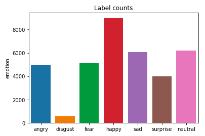 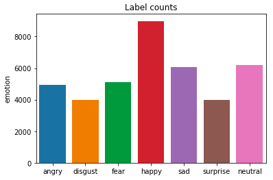

**Figure 1**: Distribution of images between the classes in the original dataset (left), compared to the distribution after upsampling of the minority “disgust class (right)

All images were preprocessed and transformed into numpy arrays, flattened and rescaled between 0 and 1 by either dividing each pixel value by 255. In addition, both training and test sets were reshaped as needed when fitting the data to the tested models.

## 5. Methods:

### 5.1 Dimension reduction

Since the accuracy of all four models (SVM, KNN, Random Forest, and SGD) when trained on the original data with minimum preprocessing (only data cleaning and scaling) expectedly showed rather low performance, in this section we cover the gains in performance achieved by each classifier on the dataset with the help of dimension reduction and feature transformation techniques.

#### 5.1.1 EigenFace

The simplest pattern recognition method is based on matching between patterns, but when the image itself is treated as a pattern, the dimensions of the pattern become enormous. Therefore, several methods have been proposed for matching after information compression of the pattern. One of the methods is the Eigenface, and the pattern is compressed by principal component analysis and used for face image identification.

We first standardized the resampled dataset and then performed the principal component analysis. Out of 2304 original components we identified 115 principal components that make up more than 90% of the explained variance in the data and used these principal components for the analysis.

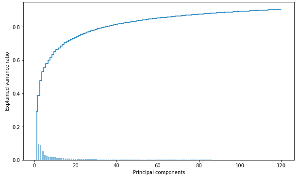

**Figure 2**: Explained variance ratio vs Principal components

The first 34 principal components contain more than 80% of the cumulative explained variance ratio. As shown in Figure 4, the first few components take care of lightning conditions and later components extract identifying features, such as the eyes, nose and mouth.

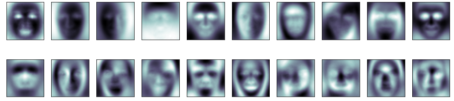

**Figure 3**: Images of first 20 components of PCA

#### 5.1.2 FisherFace

Fisherface is one of the popular algorithms used in face recognition, and is widely believed to be superior to other techniques, such as Eigenface because of the effort to maximize the separation between classes in the training process. For this method, linear discriminant analysis (LDA) is applied after the PCA. LDA finds the axis that distinguishes between two or more classes. It does not get affected easily by differences in lighting and angles compared to EigenFace. We use the PCA data from 5.1 EigenFace, with a standardized resampled dataset and 115 components, and then apply LDA. Six examples from the FisherFace result are shown in Figure 5.

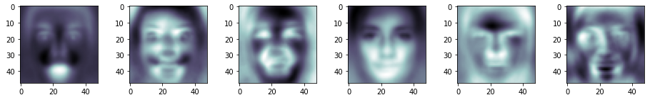

**Figure 4**: Images of fisherface

### 5.2 Feature transformation

#### 5.2.1 Histogram of oriented gradients

HoG is a popular feature descriptor for object detection in an image by first computing the horizontal and vertical gradient images, then computing the gradient histograms and normalizing across blocks, and finally flattening into a feature descriptor vector [10]. It can capture edge structure that is characteristic of local shapes and structure invariant to local photometric and geometric transformations. It is also known to outperform PCA/SIFT for a large-scale dataset [11]. Which makes HoG the perfect candidate for a feature descriptor for a large image dataset like the facial expression dataset. We have also observed that HoG was much faster and more accurate compared to SIFT and PCA. After performing HOG feature descriptor our input data feature has decreased from 2304 columns to only 1152 columns while the accuracy of our random forest model has increased by 22%.

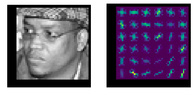

**Figure 5**: Comparison of images before and after applying histogram of oriented gradients (HoG)

#### 5.2.2 Bag of Visual Words / Features

Bag of Visual Words is a widely used image feature representation in object recognition and is a vector-quantized histogram of many local features in an image. This method was originally derived from the Bag of Words model that is often used for Natural Language Processing. First, 128 dimensional local features were extracted from each image. In our experiment, we used SIFT, KAZE, ORB, BRISK, AKAZE shown in Figure 7 to extract feature descriptors. Then, cluster all feature vectors into K clusters by using K-means. Each centroid, center vector, of K clusters is a visual word and also represented by a 128 dimensional vector. Finally, the entire image was converted into a histogram with visual words as the dimension. This is done by searching for the closest visual word for each local feature in the image and voting for that visual word. Eventually this histogram will be the feature vector of the image.

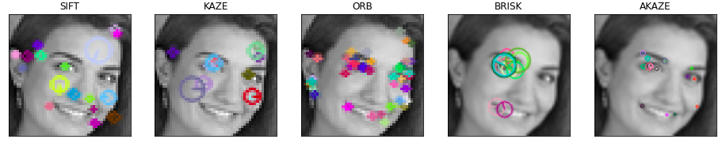

**Figure 6**: Visualization of SIFT, KAZE, ORB, BRISK, and AKAZE feature detection algorithms

### 5.3 Conventional Machine Learning

#### 5.3.1 Support Vector Machine (SVM)

We chose to use an SVM because it has the ability to capture complex relationships in both regression and classification problems. The SVM accounts for nonlinearity in features and can be tuned to balance bias and variance effectively. In previous research conducted on this topic, SVMs were also shown to provide a baseline for understanding what kinds of features are relevant to this problem. Given the wide number of feature possibilities on a given face, the SVM was best suited to our task. For our analysis, we use the parameter of &quot;one-vs-one&quot; strategy, radial basis function kernel and 1/number of features (auto) as gamma.

#### 5.3.2 K-Nearest Neighbor Classifier (KNN)

K-nearest neighbor classifier was selected because of its ability to produce complex nonlinear decision boundaries and the ease of implementation. KNN is another classification method based on the closest training example in the feature space and is often used in pattern recognition. It is intuitive and easy to use but also easily overfits. We used 2 numbers of neighbor, distance weight, and Minkowski metric for the evaluation.

#### 5.3.3 Stochastic Gradient Descent Classifier (SGD)

Stochastic Gradient Descent Classifier (SDG) is a great option to start exploring image datasets since it handles large datasets efficiently and independently. It has been widely used in both text and image classification. It is an iterative model for large datasets. The model is trained based on the SGD optimizer iteratively. It is also a great option when computation resources are limited since it is to fit in the memory due to a single training example being processed by the network. To find the best param for the model we performed a grid search of 1200 fits and increased our accuracy rate by 33%. However, due to frequent updates, the steps taken towards the minima are very noisy. This can often lean the gradient descent into other directions.

#### 5.3.4 Random Forest

The random forests algorithm is a machine learning technique that is increasingly being used for image classification. Random forests is an ensemble model which means that it uses the results from many different models to calculate a response. In most cases the result from an ensemble model will be better than the result from any one of the individual models [12]. It seeks to minimize the heterogeneity of the two resulting subsets of the data created by the respective rule. One of the key advantages of random forests is that, is not very sensitive to the parameters used to run it and it is easy to determine which parameters to use [13]. To find the best param for the model we performed a grid search of 1200 fits and increased our accuracy rate to 55.1%, which is the highest accuracy rate of our Machine Learning algorithm.

### 5.4 Convolutional Neural Network with TensorFlow and Keras

#### Model Design

We evaluated a variety of model architectures, experimented with optimizers, loss functions, regularization parameters and 4 data preprocessing steps. Our final model was capable of achieving 68.57% validation accuracy, which significantly outperformed conventional machine learning algorithms. Through experimentation and testing we settled on the optimal design of the neural network (see Figure XXX), which included a total of 15 layers:

- 4 sets of convolutional and pooling layers followed by 50% dropout layer. Each convolutional layer had a 3x3 kernel size, RELU activation function, and a number of filters doubling in each consecutive layer, starting at 32 in the input layer and going up to 256 in the fourth convolutional layer.
- Flatten layer followed by two sets of fully connected layers, each with its own dropout layer (30% and 25%).
- Lastly, a fully connected layer with 7 units and a softmax activation function for the final prediction of the image class.

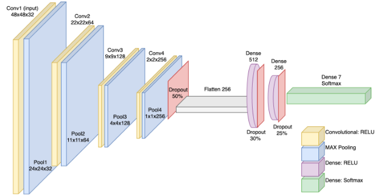

**Figure 8**: Convolutional Neural Network with 15 layers:  4 sets of convolutional and pooling layers; flatten layer followed by two sets of fully connected layers, each with its own dropout layer, and a fully connected layer for the final prediction of the image class.

#### Model Parameters and Data Preprocessing

We tested CNNs with Adam and Stochastic Gradient Descent as optimizers, but achieved better performance with Root Mean Squared Propagation, which is known for its ability to solve a common problem of neural networks with many layers that tend to either explode or vanish.

RMSProp uses a moving average of squared gradients to normalize them and then divides the gradient by the root of that average, which effectively makes the learning rate adaptive. We also included three dropout layers in the design of the network, as one of the regularization techniques, dropping up to half of the neurons to prevent overfitting due to proximity bias (training of neurons located close to each other with very similar values).

We also tested kernel and bias regularizers with different combinations of L1, L2, L1L2 regularizations but achieved better results with the activity regularizer that applies a penalty on the layer&#39;s output (as opposed to layer&#39;s kernel or bias) and L2 regularization set to 0.001.(see appendix)

One of the steps that helped us reduce overfitting and significantly increase training speed was augmentation of existing images. In addition to scaling the pixel values for all images between 0 and 1 we used a random combination of 40 degree rotation, horizontal flip, 20% width/height shift, zoom, and shear on each training example and fed the modified images to the model in batches of 1,024 images which allowed us to increase training speed by over 6.5x.

#### Activation Maps

To look at what happens under the hood of the neural network we looked at activation of the network during the forward pass. Simply put activation functions help determine whether a given neuron within a layer gets activated or not based on the input data it receives. To visualize the transformations of an image as it goes through filters of each layer we dissected the model by layers to see how the image is changing as it goes through filters of each layer making the output of one layer an input for the next. Figures xx through xx illustrate how the image is being transformed by the first four layers of the neural network.

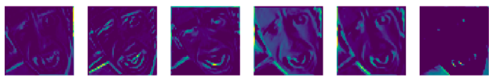

**Figure 8**: 6 out of 32 images (48 x 48 each) from the first Convolutional layer, 3x3 kernel size, RELU activation function

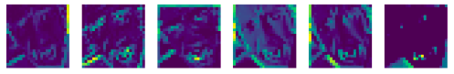

**Figure 9**: 6 out of 32 images (24 x 24 each) from the first Pooling Layer

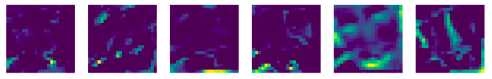

**Figure 10**: 6 out of 64 images (22 x 22 each) from the Second Convolutional Layer

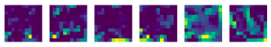

**Figure 11**: 6 out of 64 images (11 x 11 each) from the first Second Pooling Layer

As the image goes deeper into the layers of the model, the activations start looking more sparse and localized. Figure xx shows activations of the same image by layers

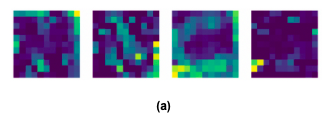 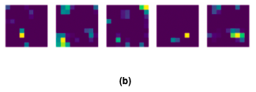

 

**Figure 12**: Activation Maps for inner layer for a convolutional neural network:

**a)** Third Convolutional Layer (9x9 images) **b)** Third Pooling Layer (4x4 images)

**c)** Fourth Convolutional Layer (4x4 images) **d)** Fourth Pooling Layer (1x1 images)

## 6. Evaluation:

### 6.1 Conventional Machine Learning

#### 6.1.1 Testing accuracy comparison

To compare the results achieved by for four simple Machine Learning algorithms, we use EigenFace, FisherFace and HoG data as described in 5. Methods section. The following figure shows the test accuracy for each Machine Learning algorithm. Among SVM, EigenFace was the highest score, however, the training accuracy was 99% which means that the result is way overfitting. Therefore, HoG of 47% testing accuracy with 53% training accuracy makes the best result for SVM. HoG is also the highest for KNN with 51% accuracy. We use a small number of neighbors for this comparison, therefore training accuracy becomes 99%. Overall, the highest test accuracy is 51% for the Random Forest algorithm. Most of the accuracy are below 50% which seems bad, however, it is acceptable compared to the 22% benchmark.

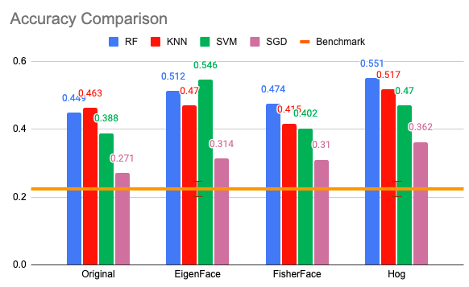

**Figure 13**: ML testing accuracy comparison

We also use the Bag of Visual Word technique to compare for SVM and KNN, however, all of the descriptor cases are below the benchmark. Therefore, we drop this technique to apply for further analysis and other Machine Learning algorithms. More detailed comparison for each technique are available in appendix.

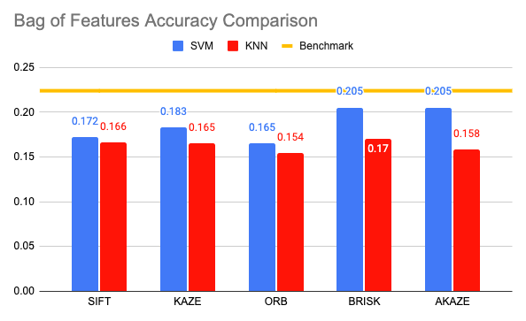

**Figure 14**: Comparison of testing accuracy for SVM and KNN classifiers on data transformed using Bag of VisualWords

#### 6.1.2 Confusion matrices

All of the confusion matrices show the highest accuracy for the happy label due to the amount of the happy label data we trained. Disgust also shows high accuracy compared to any other labels and it is because we resampled the disgust label data.

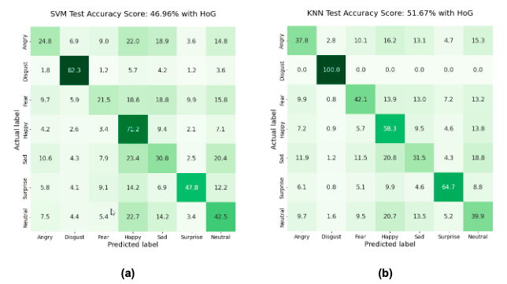

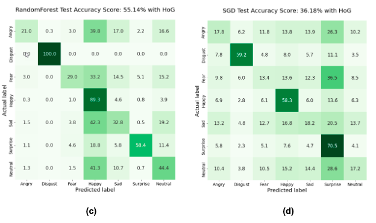

**Figure 15**: Confusion matrices for the validation accuracy of models fitted to the data transformed with HoG:

**a)** Support Vector Machine; **b)** K-Nearest Neighbors; **c)** Random Forest; **d)** Stochastic Gradient Descent

#### 6.1.3 Performance metrics with HoG

Here are the overall performance scores for each Machine Learning Classifier. Random Forest marks the highest F1 score and second is KNN. Precision of Random Forest is 64% which are very high compared to other classifiers.

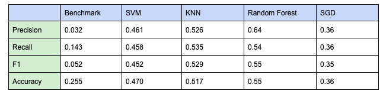

**Figure 16**: Overall performance metrics for each model: Support Vector Machine, K-Nearest Neighbors,Random Forest, Stochastic Gradient Descent Classifier

#### 6.1.4 Classification Reports

Classification report also indicates a similar result as the confusion matrices. Highest F1-score of each classification are disgust, happy and surprise labels. Happy and disgust recall is higher than precision, however surprise precision is higher than its recall. Happy label shows high scores because it has more data than any other labels. Disgust score is not precise due to the resampling. Surprise label has the lowest number of data, therefore the precision could mark higher than recall.

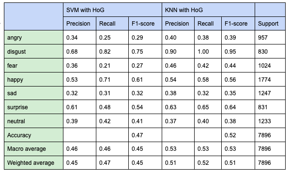

**Figure 17**: Classification report for SVM and KNN classifiers showing precision, recall, and F1 score by class. Both models were trained on the data transformed with HoG.

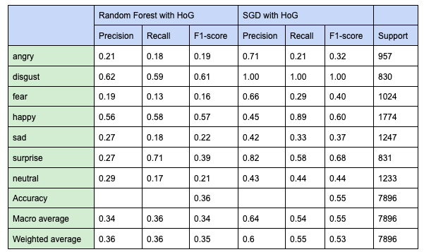

**Figure 18**: Classification report for Random Forest and SGD classifiers showing precision, recall, and F1 score by class. Both models were trained on the data transformed with HoG.

#### 6.1.5 Validation curve

Validation curve for SVM increases as parameter C becomes larger, and the model starts overfitting. We determined that the best balance between accuracy and the ability of the model to generalize is achieved with the parameter C equal 10. KNN shows high accuracy when Number of Neighbors is small.

Verification curve for SVM

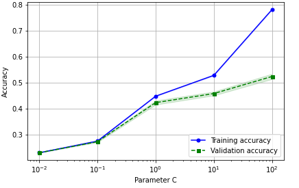

**Figure 19**: Validation curve for the SVM classifier

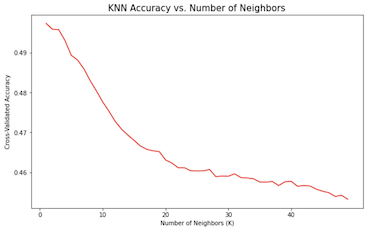
**Figure 20**: Accuracy of the KNN model as a function of number of neighbors K

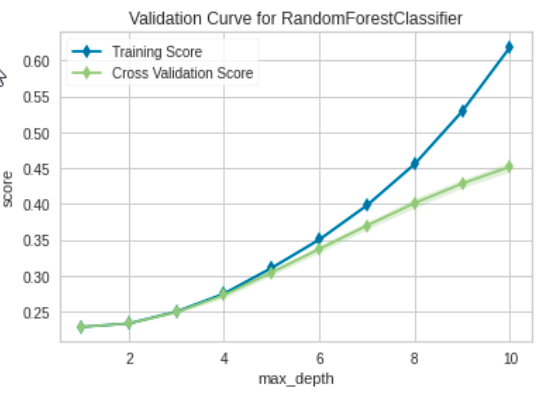

**Figure 21**: Validation curve for the Random Forest classifier

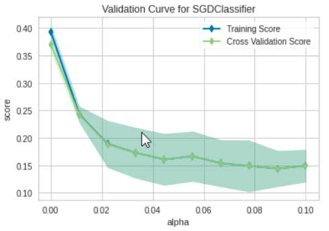

**Figure 22**: Validation curve for SGD classifier

#### 6.1.6 Learning curve

Since SVM with PCA was overfitting, we chose SVM with HoG as the best result among SVM. Figure X shows the learning curve for SVM with HoG and more data trained the result gets better and training and validation accuracy get closer.

For the learning curve, KNN and Random forest show 100% training accuracy from the beginning of training. With KNN, any training dataset, EigenFace or FisherFace, showed almost 100% training accuracy. By default the decision tree in random forest is not pruned thus the majority tree in the forest will recall the training case hence the training score is 100%.

Learning curve for SVM with HoG Learning curve for KNN with HoG

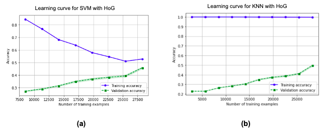

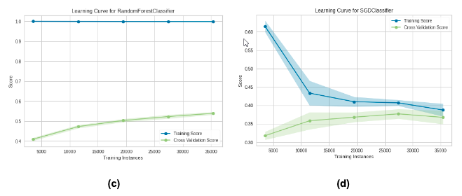

**Figure 23**: Learning curve of models fitted to the data transformed with HoG:

**a)** Support Vector Machine; **b)** K-Nearest Neighbors; **c)** Random Forest; **d)** Stochastic Gradient Descent

### 6.2 Convolutional Neural Network - Model Evaluation and Testing

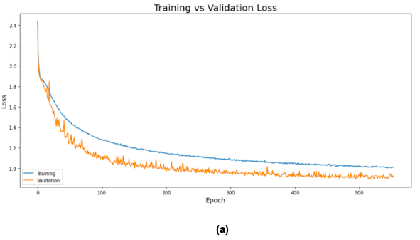 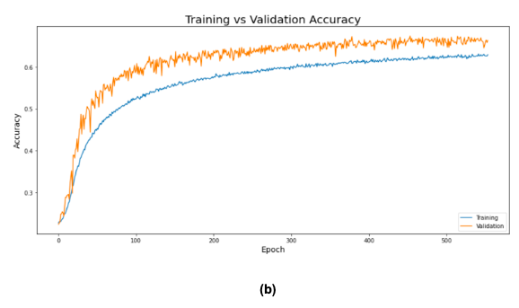

**Figure 24**: Convolutional Neural Network: Model Evaluation and Testing after 554 epochs
**a)** Training vs Validation Loss, **b)** Training vs Validation Accuracy 

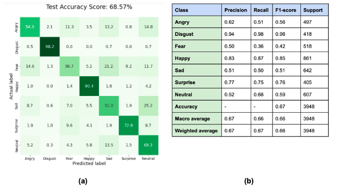

**Figure 25**: Convolutional Neural Network: Model Evaluation and Testing after 554 epochs

**a)** Confusion Matrix; **b)** Classification Report 

## 7. Conclusion:

Fig XX summarizes validation accuracy achieved by the models tested. Setting up a machine learning pipeline to scale the data, do PCA and apply HOG feature transformation allowed us to significantly improve the performance of conventional algorithms with Random Forest classifier showing the validation accuracy of 55.10%, which is the closest to the accuracy level of 68.57% achieved by the convolutional neural network.

**Fig xx.** Validation accuracy by model

Other methods tested with each model such as EigenFace, FisherFace, and Bag of Visual Words showed significantly lower performance as shown in the above sections. It is worth noting that the imbalanced nature of the FER2013 dataset makes the already challenging and arguably subjective task of emotion recognition even more difficult. Overall the improvement seen with each model after applying

On the other hand, the increase in performance of each model attributed to the experimentation with various data augmentation and transformation techniques highlights the importance of preprocessing of the data and fine-tuning of each model to achieve better results.

Even simple methods such as EigenFace and HoG made better results than the original dataset. We expected that Bag of Visual Words would perform better but it was not even good as a benchmark.

## 8. Attribution:

Project repository

[https://github.com/chikakoto/facial-expression-recognition](https://github.com/chikakoto/facial-expression-recognition)

Insert Github bar graph &amp; visualization of when commit occured

Chikako contributed writing codes for data preparation, dimension reduction, feature transformation, SVM, KNN and webcam live demonstration. Total hours of coding work is X hours and total meeting hours is X hours.

## 9. Bibliography:

1. MANAS SAMBARE: FER-2013

[https://www.kaggle.com/datasets/msambare/fer2013](https://www.kaggle.com/datasets/msambare/fer2013)

1. Research Prediction Competition: Challenges in Representation Learning: Facial Expression Recognition Challenge

[https://www.kaggle.com/competitions/challenges-in-representation-learning-facial-expression-recognition-challenge/data](https://www.kaggle.com/competitions/challenges-in-representation-learning-facial-expression-recognition-challenge/data)

1. Goodfellow1, D. Erhan: &quot;Challenges in Representation Learning: A report on three machine learning contests&quot;, arXiv:1307.0414.

[https://arxiv.org/abs/1307.0414](https://arxiv.org/abs/1307.0414)

1. Saeed, J. Baber, M. Bakhtyar: &quot;Empirical Evaluation of SVM for Facial Expression Recognition&quot;. International Journal of Advanced Computer Science and Applications,

Vol. 9, No. 11, 2018

[https://pdfs.semanticscholar.org/b476/20c2d7698adf3f369d98b97fc9bba0ef3133.pdf](https://pdfs.semanticscholar.org/b476/20c2d7698adf3f369d98b97fc9bba0ef3133.pdf)

1. Mustamin Anggo and La Arapu, &quot;Face Recognition Using Fisherface Method&quot;, IOP Conf. Series: Journal of Physics: Conf. Series 1028 (2018) 012119 [https://iopscience.iop.org/article/10.1088/1742-6596/1028/1/012119/pdf](https://iopscience.iop.org/article/10.1088/1742-6596/1028/1/012119/pdf)
2. Matthew A. Turk and Alex P. Pentland, &quot;Face recognition using eigenfaces&quot; Proc. IEEE Conference on Computer Vision and Pattern Recognition, pp. 586–591 (1991)

[https://sites.cs.ucsb.edu/~mturk/Papers/mturk-CVPR91.pdf](https://sites.cs.ucsb.edu/~mturk/Papers/mturk-CVPR91.pdf)

1. Peter N. Belhumeur, João P. Hespanha, and David J. Kriegman: &quot;Eigenfaces vs. Fisherfaces: Recognition Using Class Specific Linear Projection&quot; IEEE Transaction on Pattern Analysis and Machine Intelligence, Vol. 19, No. 7, July 1997

[https://cseweb.ucsd.edu/classes/wi14/cse152-a/fisherface-pami97.pdf](https://cseweb.ucsd.edu/classes/wi14/cse152-a/fisherface-pami97.pdf)

1. Csurka, C. Dance, L.X. Fan, J. Willamowski and C. Bray &quot;Visual Categorization with Bags of Keypoints&quot; International Workshop on Statistical Learning in Computer Vision, ECCV, pp. 1–22, 2004.

[https://www.cs.cmu.edu/~efros/courses/LBMV07/Papers/csurka-eccv-04.pdf](https://www.cs.cmu.edu/~efros/courses/LBMV07/Papers/csurka-eccv-04.pdf)

1. Sandipan Dey &quot;Python Image Processing Cookbook&quot; Chapter 8 (2020)
2. Dalal, B. Triggs, &quot;Histograms of Oriented Gradients for Human Detection&quot;, 2005, [https://lear.inrialpes.fr/people/triggs/pubs/Dalal-cvpr05.pdf](https://lear.inrialpes.fr/people/triggs/pubs/Dalal-cvpr05.pdf)
3. Dahinden, C., 2009. An improved Random Forests approach with application to the performance prediction challenge datasets. Hands on Pattern Recognition. Microtome.
4. Breiman, L., 2001. Random forests. Machine learning, 45(1), pp.5–32
5. X
6.

## 10. Appendix:

1. Comparison with different type of data in different scale for SVM and KNN

The following figures show the test accuracy on SVM and KNN with different types of data in different scales or different parameters. The first figure shows the accuracy of the original dataset, scaled original dataset, which pixels are divided by 255, HoG on original dataset, Rescaled HoG on original dataset.

The next figures are for EigenFace and FisherFace. For EigenFace, PCA on the original dataset, PCA on normalized data, PCA on standardized data, PCA on scaled data, and last one is the inverted image data from PCA on the original dataset which did the worst on SVM. FisherFace is almost the same as the PCA, and those are PCA + LDA on the original dataset, on normalized data, on standardized data or on scaled data.

 

The following figures are each descriptor in a different number of visual words, K. Original means that Bag of feature on the original dataset and PCA means that Bag of feature on PCA dataset. All of the results are below the benchmark.

 

  

ICEBOX

| **Class** | **Precision** | **Recall** | **F1-score** | **Support** |
| --- | --- | --- | --- | --- |
| **Angry** | 0.62 | 0.51 | 0.56 | 497 |
| --- | --- | --- | --- | --- |
| **Disgust** | 0.94 | 0.98 | 0.96 | 418 |
| **Fear** | 0.50 | 0.36 | 0.42 | 518 |
| **Happy** | 0.83 | 0.87 | 0.85 | 861 |
| **Sad** | 0.51 | 0.50 | 0.51 | 642 |
| **Surprise** | 0.77 | 0.75 | 0.76 | 405 |
| **Neutral** | 0.52 | 0.68 | 0.59 | 607 |
| **Accuracy** | - | - | 0.67 | 3948 |
| **Macro average** | 0.67 | 0.66 | 0.66 | 3948 |
| **Weighted average** | 0.67 | 0.67 | 0.66 | 3948 |

CNN Confusion matrix

**Fig xx.** Validation accuracy by model
